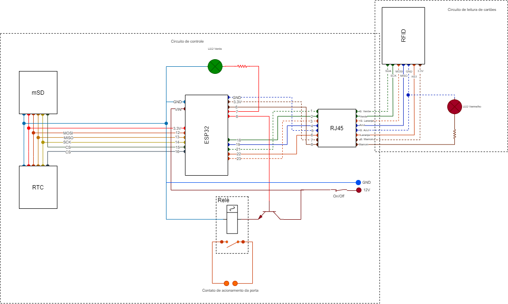

## Mapeamento do RFID

| PORTA | FUNÇÃO | COR DO CABO |
| :---- | :----- | :---------- |
| GND   | GND    |
| 3.3V  | 3.3v   |
| 22    | RESET  |
| 21    | SDA    |
| 23    | MOSI   |
| 19    | MISO   |
| 18    | SCK    |
| --    | NC     |

## MAPEAMENTO mSD

| PORTA | FUNÇÃO | COR DO CABO |
| :---- | :----- | :---------- |
| GND   | GND    |
| 3.3V  | 3.3v   |
| 15    | CS     |
| 12    | MOSI   |
| 13    | MISO   |
| 14    | SCK    |

## MAPEAMENTO RTC

| PORTA | FUNÇÃO | COR DO CABO |
| :---- | :----- | :---------- |
| GND   | GND    |
| 3.3V  | 3.3v   |
| 16    | CS     |
| 12    | MOSI   |
| 13    | MISO   |
| 14    | SCK    |

## Mapeamento dos LEDS/RELÉ

| PORTA | FUNÇÃO       | COR DO CABO |
| :---- | :----------- | :---------- |
| 6     | LED VERMELHO |
| 7     | LED VERDE    |
| 8     | RELÉ PORTA   |

